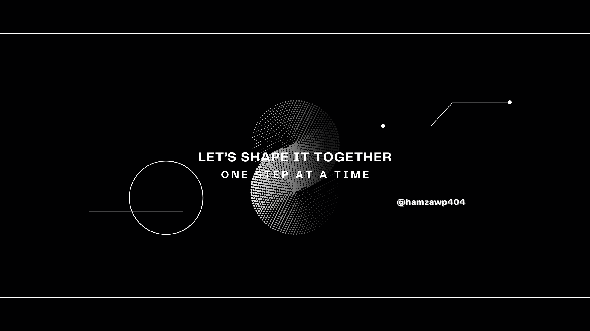

<h1 align="center">  </h1>
 

 
Know more

### About Me
 
On my way to help humanity to reach thier full potential with my programming skills, business leadership/entrepreneurship skills, and a desire to contribute to the environment and society

- Skilled in C++, Python and JavaScript. Versed with C and Java.
- Comfortable working with ReactJS, NextJS, Sass, Django, Material UI, Firebase, Django, NodeJS (Express.js), MySQL.
- Currently enjoying competitive programming and problem-solving.
- Keen interest in Data Science, Empirical Research, Statistics, and Machine Learning. 
- Well-versed with Git, GitHub, Figma, and Canva

 

### Connect with me

|  |  |  |  |  |

